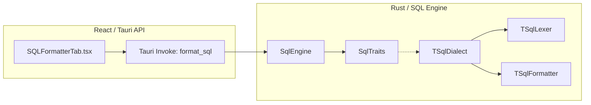

# System Architecture: SQL Formatting Pipeline
## Version: 1.1.0
## Last updated: 2026-04-22 – Modularized trait-based architecture
## Project: uni-translate

### Overview
The SQL Formatter utilizes a decoupled, data-oriented architecture. The system is designed around a trait-based engine in Rust, allowing for multi-dialect support (TSQL, MySQL, Postgres) through dependency injection.

### Component Diagram

### Data Flow
1. **Request**: UI triggers a `format_sql` invoke with the `raw_sql` string.
2. **Orchestration**: `SqlEngine` is initialized with a specific `SqlDialect` (e.g., `TSqlDialect`).
3. **Tokenization**: The `Lexer` trait implementation scans the string and produces a `Vec<Token>`.
4. **Transformation**: The `SqlProcessor` (Formatter) trait implementation consumes tokens and builds a standardized `String` based on `DialectConfig`.
5. **Response**: The result is returned through the Tauri bridge.

### Design Patterns
- **Composition over Inheritance**: Features are broken into small, independent traits (`Lexer`, `SqlProcessor`).
- **Dependency Injection**: The `SqlEngine` is dialect-agnostic, receiving its behavior through a boxed `SqlDialect`.
- **Plugin Architecture**: New SQL dialects can be added by implementing the `SqlDialect` trait without modifying core engine logic.

### Window Management
- **tauri-plugin-window-state**: Persists window position and size across sessions, improving UX for multi-monitor setups.
