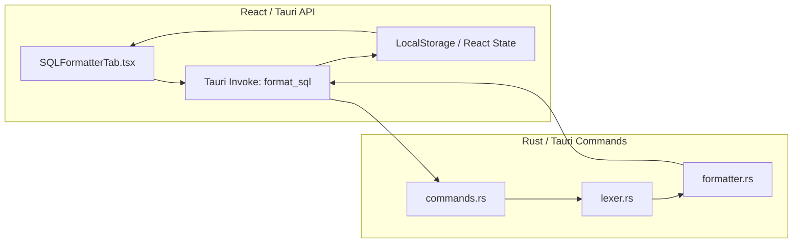

# System Architecture: SQL Formatting Pipeline
## Version: 1.0.0
## Last updated: 2026-04-22 – Initial architecture overview
## Project: uni-translate

### Overview
The SQL Formatter utilizes a decoupled architecture where heavy computational work (tokenization and formatting) is offloaded to the Rust backend, while the frontend handles state management and reactive UI updates.

### Component Diagram

### Data Flow
1. **Request**: UI triggers a `format_sql` invoke with the `raw_sql` string.
2. **Tokenization**: `lexer.rs` scans the string and produces a `Vec<Token>`.
3. **Transformation**: `formatter.rs` consumes the `Vec<Token>` and builds a new `String` using a stateful `Writer` (W) that manages indentation and spacing.
4. **Response**: The standardized `String` is returned through the Tauri bridge.
5. **Rendering**: The UI displays the formatted string in a syntax-highlighted `CodeContainer`.

### Design Patterns
- **Pipeline Pattern**: Lexer -> Formatter flow ensures concerns are separated.
- **Stateful Writer**: The formatter uses a private writer struct to encapsulate indentation logic.
- **Tauri Commands**: Serves as the secure bridge between JS and Rust.
