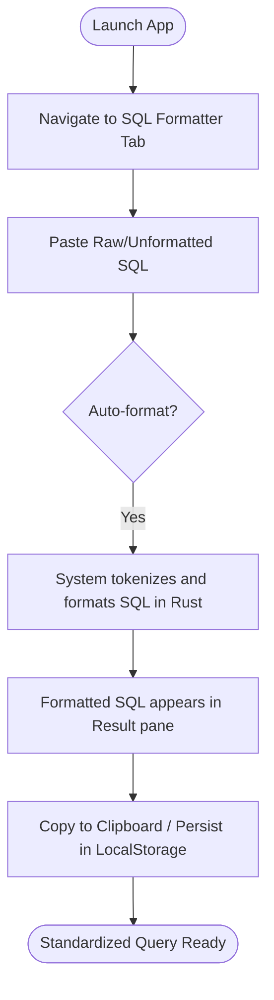

# User Flow: SQL Formatter
## Version: 1.0.0
## Last updated: 2026-04-22 – Initial user flow documentation
## Project: uni-translate

### Overview
This document describes the user journey for standardizing SQL queries using the SQL Formatter Pro interface.

### User Journey

### Step-by-Step Description
1. **Navigation**: User selects the "SQL Formatter Pro" tab from the main navigation sidebar.
2. **Input**: User enters or pastes a SQL query into the "Source SQL" editor (CodeMirror/Monaco).
3. **Execution**:
   - The frontend sends the query string to the Rust backend via the `format_sql` Tauri command.
   - The Rust backend tokenizes and standardizes the SQL.
   - If an error occurs, the original string is returned with a warning.
4. **Result**: The "Standardized SQL" pane updates instantly with the polished output.
5. **Finalization**: User copies the result using the dedicated "Copy" button. The last query is automatically saved to `localStorage` for continuity.
